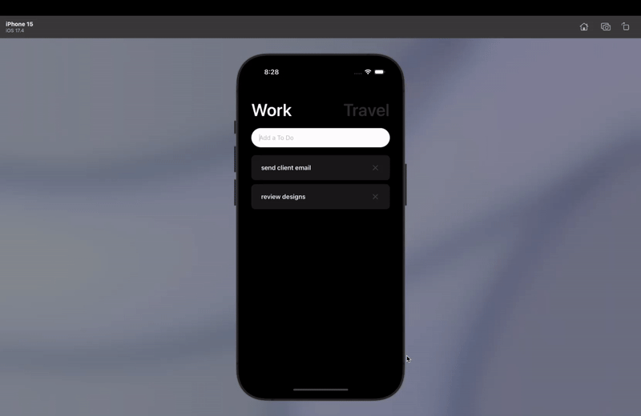

# 🗒 Work/Travel Todo 앱

React Native로 제작된 Todo 관리 앱입니다. Work와 Travel 두 가지 카테고리로 할 일을 구분하여 관리할 수 있습니다.



## ✨ 주요 기능

- Work/Travel 모드 전환
- Todo 항목 추가/삭제
- 앱 재실행 시 마지막 상태(Work/Travel) 유지
- AsyncStorage를 활용한 데이터 영구 저장

## 🛠 기술 스택

- React Native
- TypeScript
- @react-native-async-storage/async-storage
- react-native-vector-icons

## 📱 구현된 기능

### 1. 상태 관리
- `useState`와 `AsyncStorage`를 활용하여 Todo 항목과 현재 모드(Work/Travel) 상태 관리
- 앱 종료 후 재실행시에도 데이터 유지

### 2. UI/UX
- 직관적인 모드 전환 버튼
- 각 모드별 맞춤 입력 플레이스홀더
- Todo 항목 삭제시 확인 알림
- 스크롤 가능한 Todo 리스트

### 3. 스타일링
- 모드별 차별화된 색상 테마
- 모던한 디자인의 입력 필드
- 깔끔한 카드 형태의 Todo 항목

## 🚀 향후 개발 계획

- [ ] Todo 완료 기능 추가
- [ ] Todo 수정 기능 추가
- [ ] 카테고리별 통계 기능
- [ ] 날짜/시간 정보 추가

## ⚙️ 설치 및 실행

```bash
# 패키지 설치
npm install

# 개발 서버 실행
npm run start

# iOS 실행
npm run ios

# Android 실행
npm run android
```
